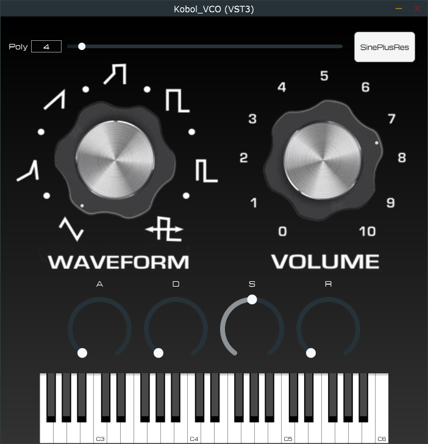

# TFG-Kobol-BoscoOlives
## Análisis &amp; Síntesis VCO
El análisis es generado a partir de los notebook en Python, con Essentia. Los resultados son guardados en archivos .json (escoger la ruta deseada). Existe la función de síntesis en el propio notebook (audioSynthesis)

## JUCE Project Plugin VST3:
Existen dos proyectos de JUCE en la carpeta JUCE_Projects. El original Plugin_Kobol_VCO_All_Samples genera un plugin VST3 que emula el sonido del sintetizador  RSF Kobol Rack Expander I, con la intención de preservar el sonido original de este. A partir de 20 muestras grabadas por cada forma de onda, y mitades entre dos formas de onda. Grabadas en un Kobol real situado en la Universidad Pompeu Fabra.

El segundo proyecto, Plugin_Kobol_VCO_All_Samples, es una versión reducida, utilizando para cada forma de onda, un solo audio de muestra grabado en 880Hz (A5).

## Ejemplo GUI VST3

